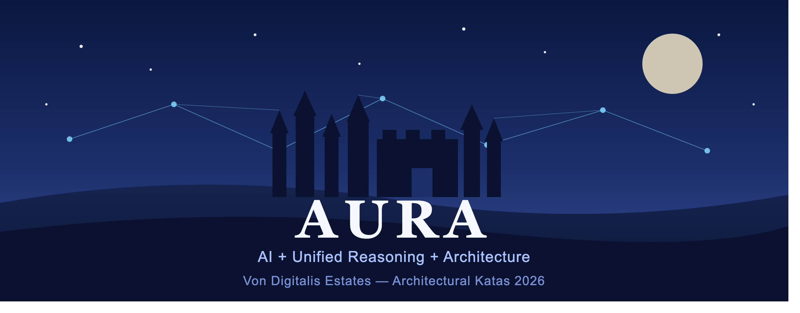

# AURA - Von Digitalis Estates | O'Reilly Architectural Katas (2026)

A structured approach to the **O'Reilly 2026 Architectural Kata Challenge: Von Digitalis Estates**.

## Overview

The Countess needs the estate to see itself, protect its animals, and grow 3x — with patchy Wi-Fi, a lean staff, and no existing systems. AURA answers this with four AI use cases layered onto a deterministic core, never replacing it: an advisory ticket/pass assistant that falls back to rule-based recommendations if AI is slow or wrong; an MQTT sensor pipeline that turns footfall into staffing nudges, with the live feed and the AI forecast kept structurally separate so staff always know which is which; computer-vision and sensor-fusion animal health monitoring (including a biomass/feeding-based solution for the piranhas, since cameras can't reliably count fast schooling fish) that is deliberately biased toward false alarms over missed ones; and event-driven personalization that turns first-time visitors into repeat ones. Every AI call routes through one internal gateway so a provider price change, outage, or model swap is a config change, not a rewrite, and every AI-derived decision produces a human override signal that is the estate's primary "is AI still working" metric in production. High-stakes physical actions — staff dispatch on a heritage ride or exotic-animal incident — always stay human-gated; low-stakes ones run autonomously. See [Solution](#solution) for the full design, or jump straight to a [use case](#automation-use-cases-using-ai) or [ADR](ADRs/).

## Table of Contents

- [Overview](#overview)
- [Team](#team)
- [Glossary](#glossary)
- [Problem definition](#problem-definition)
  - [Context](#context)
  - [Current State](#current-state)
  - [Challenges](#challenges)
  - [Key Objective](#key-objective)
  - [Constraints](#constraints)
- [Solution](#solution)
  - [Business outcomes targeted](#business-outcomes-targeted)
  - [Automation use-cases using AI](#automation-use-cases-using-ai)
  - [Golden Path — Actor Lifecycles](#golden-path--actor-lifecycles)
  - [Event Storming — Identifying the Services](#event-storming--identifying-the-services)
  - [Architecture Quantum Identification](#architecture-quantum-identification)
  - [Architecture characteristics](#architecture-characteristics)
  - [Architecture blueprint](#architecture-blueprint)
  - [Detailed architecture designs](#detailed-architecture-designs)
    - [Ticketing & visitor experience use case](#ticketing--visitor-experience-use-case)
    - [Popularity / footfall analytics use case](#popularity--footfall-analytics-use-case)
    - [Animal health & welfare monitoring use case](#animal-health--welfare-monitoring-use-case)
    - [Visitor growth & retention use case](#visitor-growth--retention-use-case)
  - [Limitations with adoption of AI](#limitations-with-adoption-of-ai)
  - [Productionizing the AI-Powered System](#productionizing-the-ai-powered-system)
- [Final thoughts](#final-thoughts)
  - [Anti-patterns](#anti-patterns)
  - [Roadmap](#roadmap)
  - [Our Learnings](#our-learnings)

## Team

- **[Mukundan Nallani Chakravartula](https://www.linkedin.com/in/mukundannc/)**, Technical Product Manager
- **[Akhil Raja Reddy Kanthala](https://www.linkedin.com/in/akhil-raja-reddy/)**, Senior Tech Lead
- **[Uday Kiran K](https://www.linkedin.com/in/udaykirankavaturu/)**, Senior Tech Lead
- **[Durga Laxmi Immadi](https://www.linkedin.com/in/durga-immadi-916893a3)**, Senior Tech Lead & UX designer
- **[Ravi Kiran Bhusetty](https://www.linkedin.com/in/ravi-kiran-bhusetty/)**, Senior Software Engineer

## Glossary
See [design_docs/glossary.md](design_docs/glossary.md).

# Problem definition

The [Overview](#overview) above summarizes how we responded to this. The estate brief itself — context, starting state, challenges, and constraints — is reproduced below for reference.

Context, current state, and challenges — click to expand

## Context

After a gardening accident, the 204th in line to the Von Digitalis title has become the **72nd Countess Von Digitalis**, inheriting a large estate that needs modernizing. The family's old business — explosive garden gnomes — is no longer viable, so the Countess is turning to digital solutions to make the estate profitable.

**Three main attractions:**

- **Amusement park** — 40 rides, an important 18th-century collection, recently passed safety inspection
- **Exotic animal collection** — 200+ animals across 55 enclosures, land and aquatic, opening to the public for the first time (including a jumping piranha collection)
- **Grounds & visitor facilities** — including ticketing and family passes

**Visitors:** ~5,000/day today → target **15,000/day within 3 years**. Missing this target means going back to the gnome business.

## Current State

Starting point is almost entirely analog:

- **Ticketing** — none exists; net-new
- **Visitor tracking** — no instrumentation; no idea which rides/zones are popular
- **Animal monitoring** — manual only; no health, feeding, or population tracking
- **Connectivity** — patchy wifi, no data pipeline to the cloud
- **Revenue** — no prior experience monetizing rides or animals at scale
- **Retention** — no repeat-visitor program

## Challenges

- **No popularity data** — can't tell which rides/zones draw crowds → hard to staff or invest well
- **Costly, reactive animal care** — sickness is expensive; no systematic health/feeding/population tracking (piranhas especially)
- **No growth strategy** — need 3x visitors in 3 years, no plan yet
- **Low repeat visits** — no loyalty or personalization, no visitor behavior data
- **Patchy connectivity** — any real-time system must handle unreliable wifi (MQTT + store-and-forward)
- **No ticketing** — can't monetize or track visitors without it
- **Profitability pressure** — must work, or it's back to garden gnomes

## Key Objective

"How might we use **AI** to help the Countess understand her estate, keep her animals healthy, and grow visitor numbers 3x — while working around patchy connectivity and a lean staff — so the Von Digitalis estates become profitable without a return to the garden gnome business?"

This breaks down into four supporting objectives:

1. **See the estate** — turn footfall across 40 rides and 55 enclosures into actionable insight, so staff and investment go where they're needed.
2. **Protect the animals** — monitor health, feeding, and population (including the piranhas) proactively, catching problems before they become costly.
3. **Grow visitation** — move from 5,000 to 15,000 visitors/day within 3 years through a working ticketing system and data-informed growth strategy.
4. **Build loyalty** — turn first-time visitors into repeat visitors through personalization and engagement.

## Constraints

Constraints taken from the estate brief, grouped so the architecture can address them directly — the AI-specific ones are what [ADR-002](ADRs/ADR-002-external-ai-integration.md) and [ADR-001](ADRs/ADR-001-ai-vendor-risk-and-monitoring.md) exist to answer.

Full constraint list — click to expand

**Technical**

- **Patchy wifi** — coverage across the park is unreliable; any solution depending on real-time data must tolerate connectivity gaps
- **MQTT hardware only** — there's budget for MQTT-capable devices to be installed throughout the park as the mechanism for getting data from the estate to the cloud; assume no other estate-wide connectivity option
- **Cloud-based** — solution can use cloud services, but must account for the gap between edge (patchy wifi) and cloud

**Business**

- **Scale today** — 40 rides, 55 animal enclosures, 200+ animals, ~5,000 visitors/day
- **Scale target** — 15,000 visitors/day within 3 years (3x growth)
- **Budget is finite** — hardware spend is sanctioned but not unlimited
- **No existing systems** — no ticketing, visitor tracking, or animal monitoring infrastructure to integrate with; this is a greenfield build

**AI-specific**

- **Model/vendor volatility** — AI is moving fast; the best model or provider today may not be the best tomorrow, so the architecture must tolerate switching models or providers
- **Pricing risk** — must handle a provider changing prices unexpectedly
- **Provider risk** — must handle a provider shutting down entirely
- **Non-determinism** — unlike deterministic functionality, GenAI outputs aren't consistently reproducible; the solution needs a way to verify AI-driven functionality is working, and detect if it starts misbehaving in production

# Solution

## Business outcomes targeted

| Outcome                                                          | Basis (compact)                                                                                                                             |
| ---------------------------------------------------------------- | ------------------------------------------------------------------------------------------------------------------------------------------- |
| **Staff efficiency: ~20% better coverage** of high-traffic zones | Pareto footfall (20% of locations → ~60% of visits); staff today spread evenly across ~95 locations. Estimate, no estate data yet.          |
| **Animal welfare cost: ~93% reduction** ($16,310 → $1,114/wk)    | AI monitoring + keeper review on ~15% flagged.                                                                                              |
| **Health incidents: ~6 fewer/year** (20 → ~14)                   | Est. ~20 events/yr (industry rate); faster detection cuts escalation lag from 12hrs to <1hr, preventing ~70% of late-detection escalations. |
| **Repeat visits: ~20% relative increase** (15% → 18%)            | Typical lift from loyalty/personalization in leisure/retail; conservative estimate.                                                         |
| **Visitor growth: 3x in 3 yrs** (5,000 → 15,000/day)             | Estate's stated target — use cases support it.                                                                                              |
| **Headcount: no linear increase** with 3x scale                  | Follows from above: hours stay flat/retargeted, not added.                                                                                  |

Refer to [detailed outcomes & cost analysis](design_docs/cost-analysis.md). These figures model the AI-assisted **steady state**. The [Roadmap](#roadmap) is the path to that state: day one stays close to today's manual baseline, and savings arrive as each use case crosses its data threshold.

## Automation use-cases using AI

Four AI-enabled use cases were prioritized for this kata:

1. **HMW use AI to make buying tickets effortless** — assisted ticket purchase, family pass recommendations, and in-park wayfinding, so visitors spend less time figuring out logistics and more time enjoying the estate? → [deep dive](usecases/hmw-01-ticket-pass-assistant.md)
2. **HMW use sensor data and AI to understand what's actually popular** — an MQTT sensor + AI pipeline that shows which zones and rides are busiest, so staff and investment go where visitors are? → [deep dive](usecases/hmw-02-footfall-staff-deployment.md)
3. **HMW use AI to keep the animal collection healthy without adding headcount** — computer vision and sensor-based monitoring of feeding, health, and piranha population levels, so issues are caught early rather than discovered too late? → [deep dive](usecases/hmw-03-animal-health-monitoring.md)
4. **HMW use AI to turn first-time visitors into repeat visitors** — personalization and targeted marketing that drive return visits, so the estate grows revenue without relying purely on new-visitor acquisition? → [deep dive](usecases/hmw-04-return-visitor-personalization.md)

## Golden Path — Actor Lifecycles

In Event Storming, the **golden path** is the sequence of events when a process completes exactly as intended — no exceptions, no errors. It's established early to give the team a shared timeline before layering in edge cases and policies.

Each lane below is one actor's golden path — the steps that must succeed, in order, for their session to count as a success.

## Event Storming — Identifying the Services

- Event storming across the five actors (Visitor, Estate Owner, Ride Staff, Animal Care Staff, Front Office) produced a first-pass candidate list: **Auth, Analytics, Staff Scheduling, Safety Checklist, Queue/IoT, Care Scheduling, Payment Gateway, Recommendation, Notification/Marketing**, and **Finance/Reporting**.
- Candidates sharing the same aggregates and scalability/availability needs were consolidated — e.g. Analytics was invoked identically for popularity reports, dashboards, and enclosure engagement.
- Safety Checklist and Queue/IoT share the same per-ride read/write pattern, so they folded into a single **Ride Operations** capability.
- Resulting services: **Ticketing, Analytics, Staff Scheduling, Ride Operations, Animal Care, Notification/Marketing**, and **Auth**.

## Architecture Quantum Identification

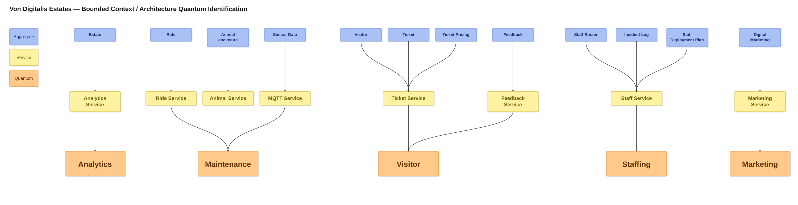

- Grouping aggregates by service, then services by shared scalability/availability/change-cadence needs, produced six candidate quanta: **Analytics, Maintenance, Visitor, Feedback, Staffing**, and **Marketing**.
- Feedback (low, steady traffic, no distinct scaling profile) folded into the **Visitor** quantum it already supports.
- Maintenance (rides, enclosures, sensor data) has real-time, safety-critical requirements the others don't share, so it stayed independent rather than merging into Visitor or Staffing.
- Final architecture quanta: **Analytics, Maintenance, Visitor, Staffing**, and **Marketing**.

## Architecture characteristics

Refer to [detailed architecture characteristics analysis](design_docs/architecture-characteristics-styles.md). Each quantum has its own driving characteristics and matching style — selected from the worksheets below, not a single style applied estate-wide. The measurable success criteria for each characteristic are defined in [Fitness Functions](design_docs/fitness-functions.md).

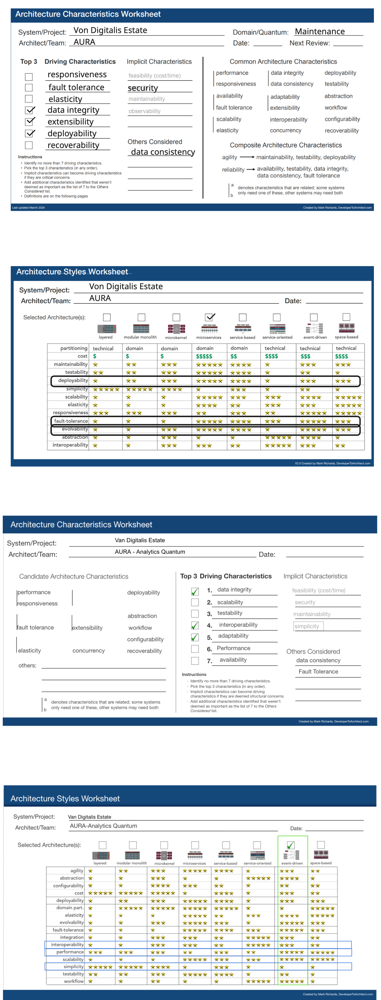
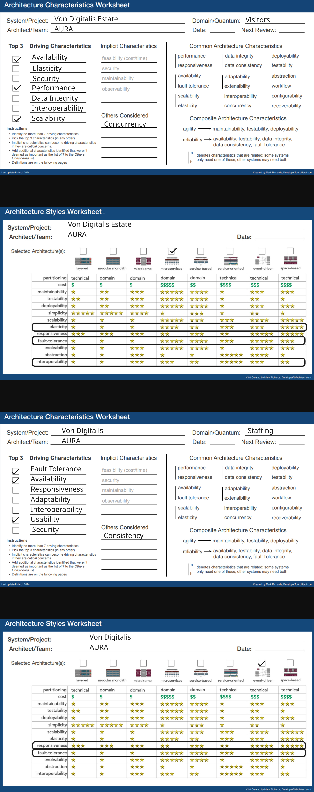

| Quantum         | Top 3 Characteristics                          | Others Considered                 | Style         | Why                                                                                                                          |
| --------------- | ---------------------------------------------- | --------------------------------- | ------------- | ---------------------------------------------------------------------------------------------------------------------------- |
| **Visitors**    | Availability, Performance, Scalability         | Concurrency                       | Microservices | Highest-traffic surface; must scale independently for 3x visitor growth                                                      |
| **Staffing**    | Fault Tolerance, Availability, Usability       | Consistency                       | Event-driven  | Deployment suggestions are useless if late or lost                                                                           |
| **Maintenance** | Data Integrity, Extensibility, Deployability   | Data Consistency, Security        | Microservices | Safety/welfare-critical; a wrong reading is worse than a slow one                                                            |
| **Analytics**   | Data Integrity, Interoperability, Adaptability | Data Consistency, Fault Tolerance | Event-driven  | Aggregates every other quantum's data; must stay correct and pluggable                                                       |
| **Marketing**   | Adaptability, Interoperability, Deployability  | Data Integrity, Availability      | Event-driven  | Campaign rules and channels change frequently; reacts to visitor behavior without coupling to Analytics or Visitor internals |

## Architecture blueprint

The five quanta compose into one system: C1 shows who talks, C2 shows how they connect. In C2, AI/ML components (purple) stay visually distinct from deterministic services (green), message brokers (blue), and storage (cylinders) — the same "AI-derived vs. ground truth" split as [ADR: Separate Raw Telemetry Path](ADRs/ADR-004-separate-raw-and-ai-derived-paths.md), applied system-wide, not only inside Analytics. The per-quantum diagrams below reuse this distinction with a diagram-local highlight color, not yet standardized to one hue across all of them — on the polish list, not an intentional signal.

### C1 - Context view

### C2 - Container view

> **Erratum:** the Model-Agnostic AI Gateway box in this diagram is labeled "ADR-04" — that decision is [ADR-002: External AI Integration Strategy](ADRs/ADR-002-external-ai-integration.md), not ADR-004 (which covers the separate raw/AI-derived telemetry paths). Noted here pending a corrected re-export of the diagram.

## Detailed architecture designs

Each use case below is summarized here; the full write-up (data flow, component detail, every relevant ADR) lives in [`usecases`](usecases/).

### Ticketing & visitor experience use case

*Use case 1 above.* Refer to [**detailed design**](usecases/hmw-01-ticket-pass-assistant.md).

**Solution approach:** deterministic ticketing core, AI as an optional advisory overlay with a rule-based fallback — never blocks a purchase.

Why, ADR by ADR — click to expand

- A deterministic **Ticketing and Family Pass core** (catalog, capacity/inventory, order & checkout) handles every purchase end to end with zero AI involvement — this is the estate's ground truth and its permanent fallback, not a stopgap.
- An **AI Advisory Overlay** reads free-text party/intent and recommends a bundle via the shared [Internal AI Gateway](ADRs/ADR-002-external-ai-integration.md) — advisory only; it never charges the visitor, and on timeout or low confidence it falls back to a rule-based recommender rather than blocking the purchase.
- A separate, lightweight **Safety/Urgency Triage** classifier on the visitor feedback path flags urgent issues for immediate routing, independent of the recommendation engine.

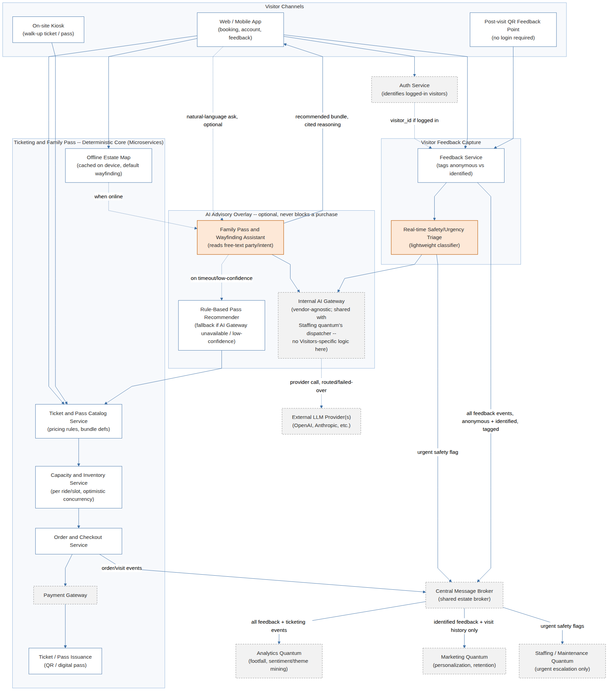

**Data flow:**

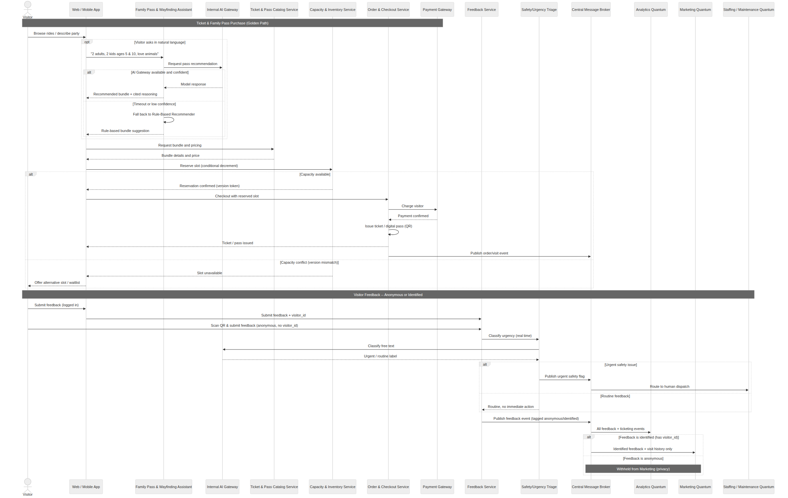

**Key screen:**

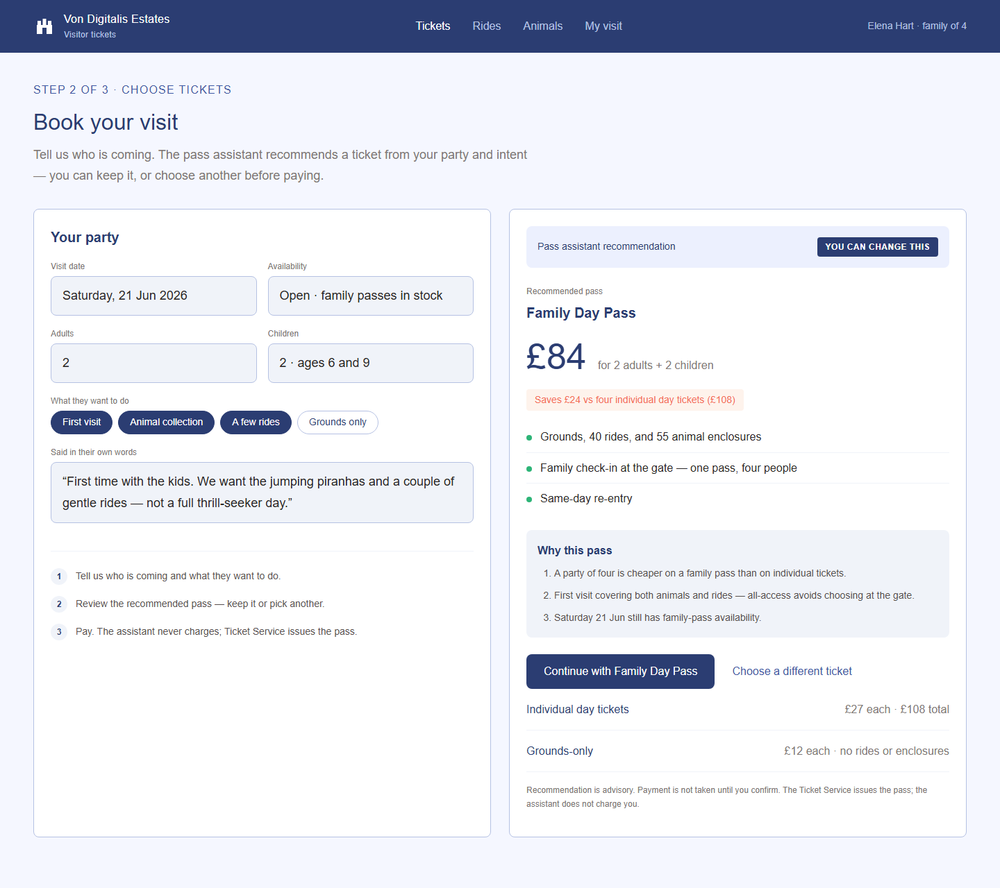

### Popularity / footfall analytics use case

*Use case 2 above* — spans two quanta: **Analytics** produces the insight, **Staffing** acts on it. Refer to [**detailed design**](usecases/hmw-02-footfall-staff-deployment.md).

**Solution approach:** Analytics produces the forecast, Staffing acts on it — raw and AI-derived feeds stay separate, and dispatch is severity-tiered with a human gate on anything high-risk.

Why, ADR by ADR — click to expand

- **Raw telemetry and AI-derived forecasts are two separate published feeds** ([ADR: Separate Raw Telemetry Path](ADRs/ADR-004-separate-raw-and-ai-derived-paths.md)) — the live heatmap is trustworthy unconditionally; the hotspot forecast carries a confidence score and only becomes a staffing nudge once it clears a threshold.
- **Two data stores for two access patterns** ([ADR: Dual Data Store Strategy](ADRs/ADR-003-dual-data-store-strategy.md)): an Events DB for auditable, reviewable insights; a data lake for bulk telemetry and trend analysis.
- **Tiered human authorization on dispatch** ([ADR: Authorization Model for AI Staff Dispatch](ADRs/ADR-013-staffing-ai-dispatch-authorization.md)): low-severity crowd nudges auto-dispatch; high-severity incidents block the field MQTT push until a manager approves, with a 45-second escalation matrix as the safety net.
- **Offline-first field delivery** ([ADR: Field Staff App Connectivity Strategy](ADRs/ADR-014-staffing-field-app-connectivity.md)): deployment plans and incident logs survive Wi-Fi dead zones via local SQLite + MQTT QoS 1.

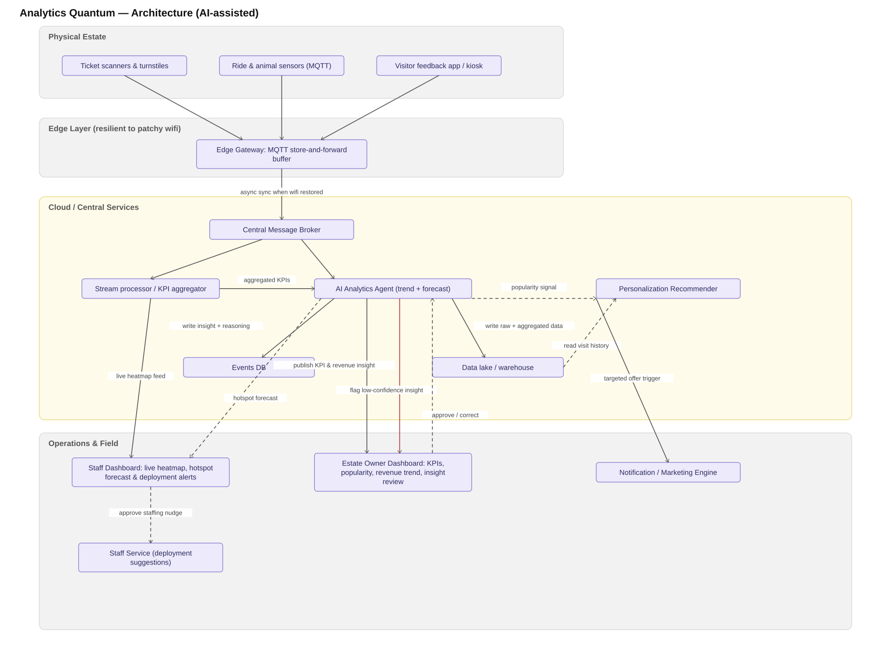
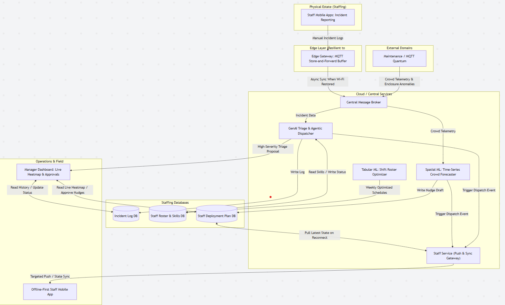

**Data flow:**

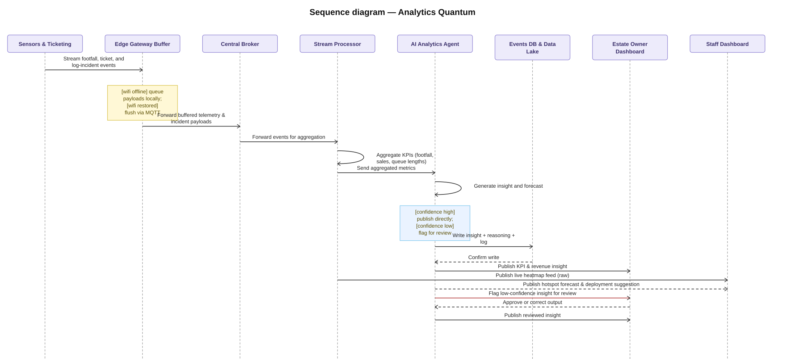
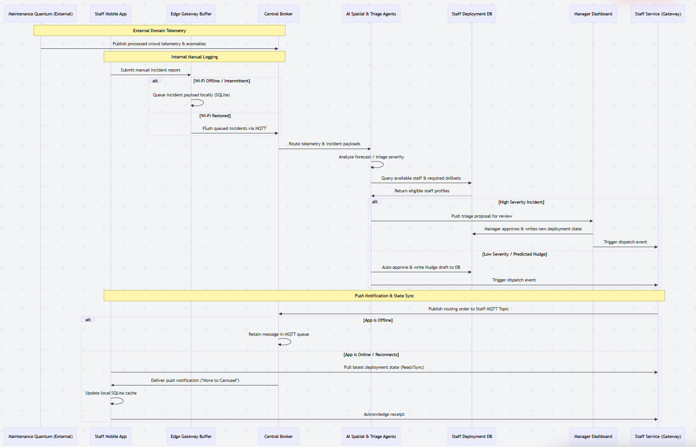

**Key screen:**

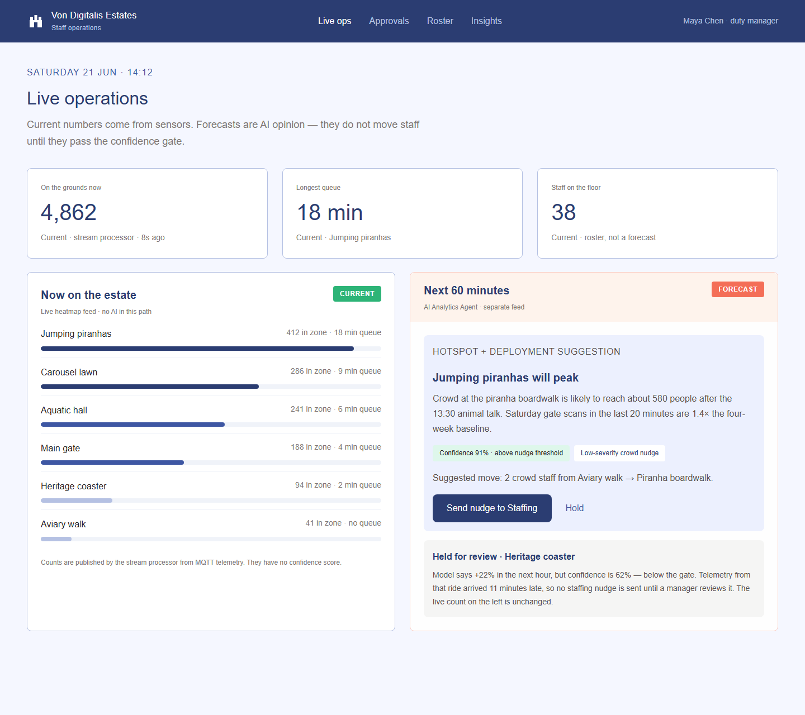

### Animal health & welfare monitoring use case

*Use case 3 above.* Refer to [**detailed design**](usecases/hmw-03-animal-health-monitoring.md).

**Solution approach:** inference stays on-estate, events survive Wi-Fi gaps via store-and-forward, and every work order must cite its source or escalate to a human rather than guess.

Why, ADR by ADR — click to expand

- **On-estate inference, selective publication** ([ADR: Ride and Enclosure Feed Ingestion Strategy](ADRs/ADR-010-maintenance-feed-ingestion.md)): edge devices turn raw video/telemetry into compact, decision-ready events, deliberately biased toward over-flagging — a false "healthy" is worse than a false alarm.
- **Disk-backed store-and-forward** ([ADR: Ride and Enclosure Event Delivery Strategy](ADRs/ADR-011-maintenance-event-delivery.md)): a connectivity gap delays an anomaly event; it never silently drops it.
- **Grounded, cited work orders that fail closed** ([ADR: Work Order Guidance Strategy](ADRs/ADR-012-maintenance-work-order-guidance.md)): the Maintenance Copilot may only draft steps from retrieved estate manuals/vet records; on weak retrieval it escalates to a human rather than inventing a procedure.

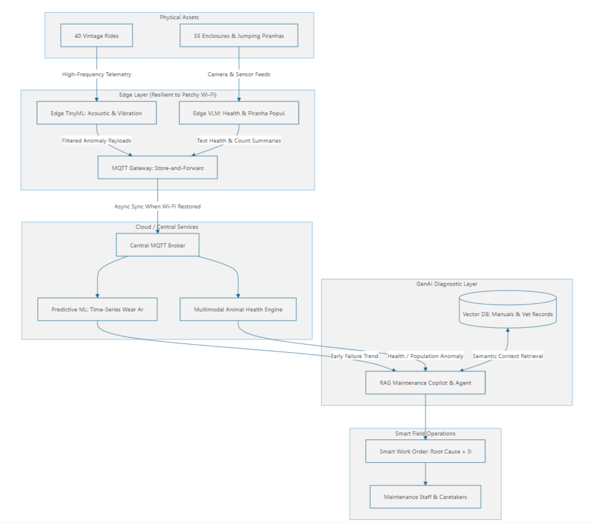

**Data flow:**

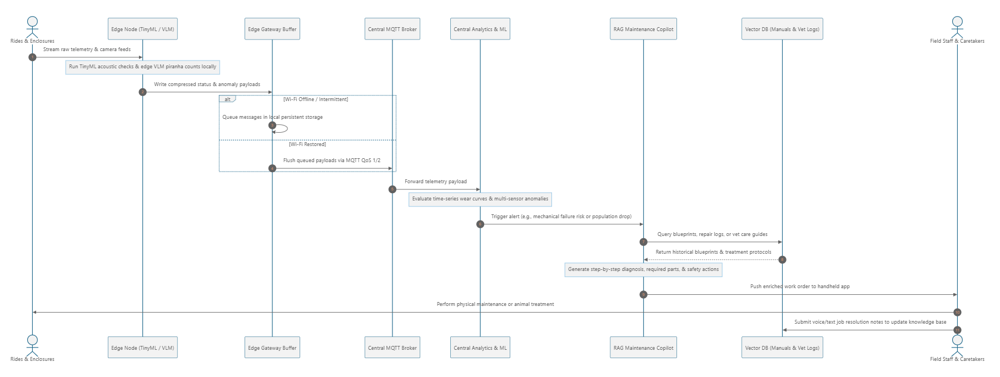

**Key screen:**

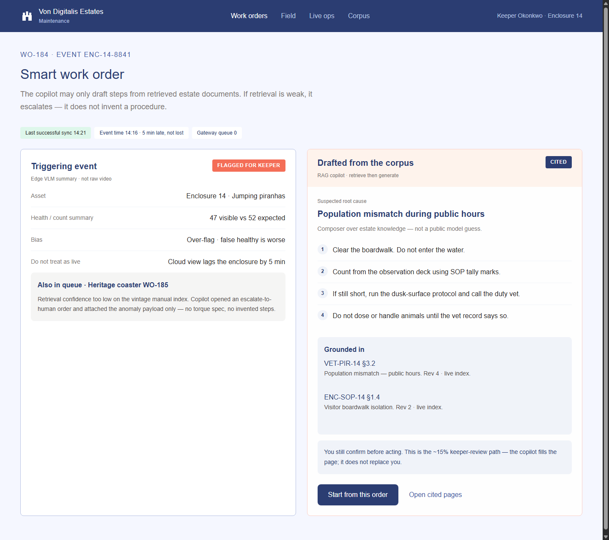

### Visitor growth & retention use case

*Use case 4 above.* Refer to [**detailed design**](usecases/hmw-04-return-visitor-personalization.md).

**Solution approach:** Marketing only reacts to published events — it never reads Analytics' internals directly — and a dismissed offer is data, not a redeploy.

Why, ADR by ADR — click to expand

- **Event-driven, not a query into Analytics' internals**: the Marketing quantum subscribes to `VisitCompleted` events and reads visit history from the data lake via a published contract — it never reaches into Analytics' stores directly, mirroring the boundary [ADR: Separate Raw Telemetry Path](ADRs/ADR-004-separate-raw-and-ai-derived-paths.md) sets for Analytics' own consumers.
- **Campaign rules and channels are swappable independently** of the recommendation logic — adding a channel (email, SMS) is additive, not a redeploy.
- **A dismissed offer is a first-class event**, not just a UI action — that published signal is what makes production monitoring of this use case possible (see [ADR: Production Monitoring & Drift Detection](ADRs/ADR-001-ai-vendor-risk-and-monitoring.md)).

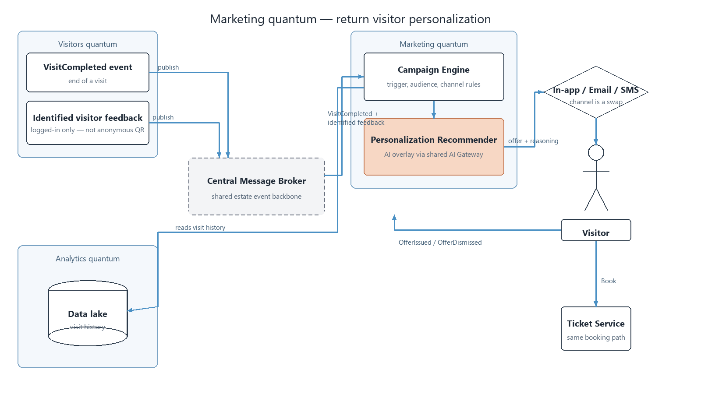

**Key screen:**

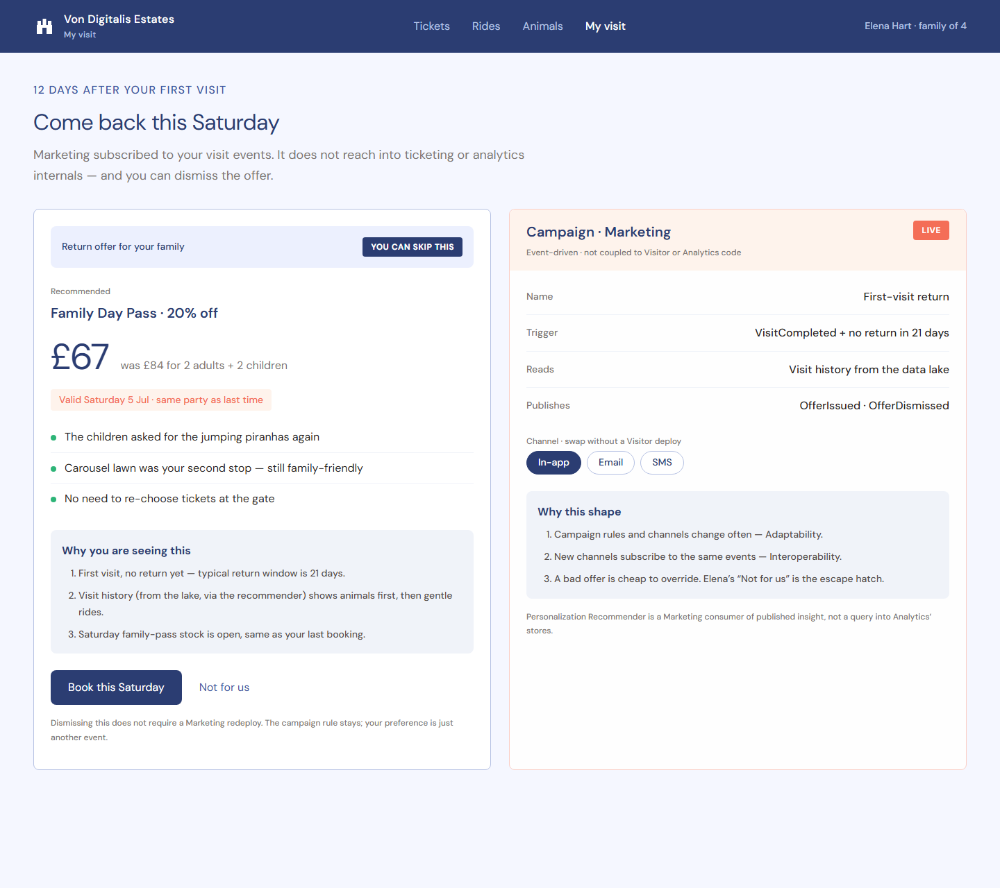

## Limitations with adoption of AI

Eleven specific, accepted trade-offs — none hidden, each with its mitigation named — rather than a claim that this design has none.

Full list — click to expand

- **Manager bottleneck on high-severity dispatch** — if the on-duty manager is away from the dashboard, a critical proposal sits pending until a 45-second escalation fires to senior staff mobiles. Accepted trade-off: we chose a named human decision on anything that can harm visitors, animals, or heritage rides over absolute automated speed.
- **Edge models are deliberately biased toward over-flagging** (Maintenance) — a false alarm rate the ~15% keeper-review workflow is sized to absorb, in exchange for never missing a real ride-safety or animal-health event.
- **Retrieval can miss or serve a stale page** (Maintenance's RAG copilot) — mitigated by failing closed to a generic escalation and by making citations visible, never eliminated outright.
- **Weak override signals in some quanta** — a visitor buying a different bundle, or dismissing a return offer, conflates "the AI was wrong" with "the visitor changed their mind." Treated as directional context, not a gating metric, until stronger explicit signals are added to those UIs.
- **Eventual consistency between quanta** — dashboards and field devices see analytics with some lag relative to when an event was produced. Acceptable for popularity/trend reporting; would not be acceptable for a use case needing near-instant consistency.
- **Two-store sync in Analytics** — an insight in the Events DB should be traceable back to the raw data that produced it in the data lake; the linking key for that trace-back is not yet detailed (see [ADR: Dual Data Store Strategy](ADRs/ADR-003-dual-data-store-strategy.md)).
- **Cold start everywhere data-dependent** — footfall forecasting, personalization, and species-specific health models all need real estate data before they can outperform a simple heuristic; see [Roadmap](#roadmap) for how each use case handles this rather than assuming day-one maturity.
- **Loss of provider-specific features** — routing every model call through a common gateway schema means we lag a vendor's newest proprietary API by design; accepted in exchange for vendor independence (see [ADR: External AI Integration Strategy](ADRs/ADR-002-external-ai-integration.md)).
- **AI Gateway is a single point of failure** — all AI calls across all five quanta route through one internal gateway. A gateway outage takes every AI feature estate-wide dark simultaneously. Mitigation: gateway is deployed with high availability in the same region as estate services; each quantum's non-LLM fallback (rule-based recommender, flag-all-urgent, human escalation) remains live regardless.
- **Heritage ride instrumentation constraints** — 18th-century rides may not tolerate standard sensor attachment methods (drilling, adhesive mounts on historic materials). The architecture assumes sensors are installable; the physical feasibility of instrumenting the heritage collection at the precision the anomaly-detection models require is not validated here.
- **Regulatory standing of AI-flagged ride anomalies** — the daily safety inspection remains a regulatory requirement (captured in cost analysis). What is not addressed: whether an AI-flagged anomaly carries sufficient legal standing to ground a ride before a certified human inspection is completed, or whether the estate's liability changes if it detects an anomaly via AI and does not act on it immediately.

## Productionizing the AI-Powered System

The estate brief asks: *"How will you know if your AI-driven functionality starts misbehaving once in production?"* Two ADRs answer two halves of that question. Every quantum reuses the same two mechanisms rather than inventing its own.

- **AI Gateway — vendor and provider risk** ([ADR: External AI Integration Strategy](ADRs/ADR-002-external-ai-integration.md)). All AI calls, across all four use cases, go through one internal gateway using a lowest-common-denominator schema. A provider price change, degradation, or shutdown is a gateway config change (reroute, fail over), never a rewrite of dispatch, triage, recommendation, or diagnostic logic.
- **Override rate and evals — behavioral drift** ([ADR: Production Monitoring & Drift Detection](ADRs/ADR-001-ai-vendor-risk-and-monitoring.md)). Every AI-derived decision already passes through a human confirm, correct, or override action (a keeper confirming a flagged animal, a manager approving a dispatch, a technician following a cited work order, a visitor accepting or skipping a recommendation). The **rolling human override rate**, tracked per model version, is the primary signal — a rise of more than 50% relative to its 30-day baseline pages an on-call engineer and pins the gateway to the last known-good model/prompt version, the same mechanism used for vendor failover. Scheduled offline evals against a held-out set back this up for low-review-volume paths (notably Staffing's auto-dispatched low-severity nudges) where a regression might not surface through overrides alone.

Two patterns recur across quanta:

- **Tiered human-in-the-loop authorization** — Staffing gates high-severity dispatch on manager approval while low-severity nudges auto-dispatch ([ADR: Authorization Model for AI Staff Dispatch](ADRs/ADR-013-staffing-ai-dispatch-authorization.md)); Analytics gates low-confidence insights the same way ([ADR: Dual Data Store Strategy](ADRs/ADR-003-dual-data-store-strategy.md)).
- **Fail closed on low confidence or weak grounding** — Maintenance's copilot escalates rather than invents a procedure when retrieval is weak ([ADR: Work Order Guidance Strategy](ADRs/ADR-012-maintenance-work-order-guidance.md)); the same rule applies to Analytics' insight review and Visitors' recommendation fallback.

None of this assumes a trained, estate-specific model exists on day one — see [Roadmap](#roadmap) for the maturity curve each use case follows, gated on data volume rather than a calendar date.

# Final thoughts

## Anti-patterns

These alternatives were considered and rejected. Each would have been faster to ship and worse in production.

Six rejected alternatives — click to expand

- **Fully autonomous AI action on high-stakes physical decisions.** Unsupervised write access to the `Staff Deployment Plan` for high-severity incidents was rejected — a hallucinated reading or a misrouted emergency involving exotic animals or heritage rides is not a risk worth the extra automation speed (see [ADR: Authorization Model for AI Staff Dispatch](ADRs/ADR-013-staffing-ai-dispatch-authorization.md)).
- **Cloud-side inference on raw estate media.** Shipping raw acoustic/vibration telemetry or camera feeds to the cloud for inference was considered and rejected — it assumes an uplink the estate does not have, and makes cost scale with camera-hours rather than incidents (see [ADR: Ride and Enclosure Feed Ingestion Strategy](ADRs/ADR-010-maintenance-feed-ingestion.md)).
- **Un-grounded generation for procedural guidance.** Letting the Maintenance Copilot draft root-cause and remediation steps from a general-purpose model's prior knowledge, with no citation to estate-specific manuals or vet records, was rejected — heritage rides and exotic species are exactly the domain a public model has never seen (see [ADR: Work Order Guidance Strategy](ADRs/ADR-012-maintenance-work-order-guidance.md)).
- **Merging raw and AI-derived signals into one feed.** An early version of the Analytics architecture routed the live heatmap and the AI hotspot forecast through the same component and the same dashboard feed. We deliberately split them so staff can trust the raw feed unconditionally and treat the forecast as reviewable AI opinion (see [ADR: Separate Raw Telemetry Path](ADRs/ADR-004-separate-raw-and-ai-derived-paths.md)).
- **Treating vendor monitoring as sufficient production monitoring.** A healthy gateway (right provider, low latency, normal cost) tells you nothing about whether the AI's *answers* are still good. We rejected relying on provider dashboards alone in favor of the override-rate-based monitoring in [ADR: Production Monitoring & Drift Detection](ADRs/ADR-001-ai-vendor-risk-and-monitoring.md).
- **Training custom models before there's data to train on.** For every use case with a cold-start problem (footfall forecasting, personalization, species-specific health detection), we rejected building a trained model as the day-one deliverable — see the phased roadmap below.

## Roadmap

Not every use case needs a trained model to start. Several have a genuine cold-start problem — no visit history, no season of footfall, no labeled "this reading was actually a problem" examples exist yet. Rather than present the AI-driven design as day-one reality, each use case follows a maturity curve gated on **data volume and time elapsed**, not a calendar date — and the transition between phases is itself gated by the override-rate monitoring from [ADR: Production Monitoring & Drift Detection](ADRs/ADR-001-ai-vendor-risk-and-monitoring.md): a candidate model doesn't get promoted until it beats the existing baseline on that metric over a held-out period.

Full Phase 0→3 maturity table, all six quanta/use cases — click to expand

| Quantum / use case                                    | Phase 0 — Day 1 (no data)                                                             | Phase 1 — Early (0–6 mo, data accumulating)                                                                                                                  | Phase 2 — Growth (6–12+ mo, enough data to train)                                                                                                                                                                                       | Phase 3 — Matured                                                                                                                                                                   |
| ----------------------------------------------------- | ------------------------------------------------------------------------------------- | ------------------------------------------------------------------------------------------------------------------------------------------------------------ | --------------------------------------------------------------------------------------------------------------------------------------------------------------------------------------------------------------------------------------- | ----------------------------------------------------------------------------------------------------------------------------------------------------------------------------------- |
| **Visitors** — ticket/pass assistant                  | Rule-based pass recommender only (party size/age → bundle lookup table, no LLM call)  | Turn on the LLM advisory overlay via the gateway — an off-the-shelf model, no fine-tuning needed since this is general NL understanding, not estate-specific | Use 6+ months of accepted/rejected recommendations to tune prompt few-shot examples and confidence thresholds                                                                                                                           | Prompt/threshold tuning is routine; the rule-based path remains a permanent fallback, never removed                                                                                 |
| **Maintenance** — ride anomaly detection              | Static threshold bands from manufacturer specs, no model                              | Off-the-shelf unsupervised anomaly detection on raw sensor data — needs no labels, just signal                                                               | Once ≥6 months of sensor history with keeper-confirmed outcomes exists (enough to span normal seasonal/usage variance across 40 distinct rides), train a per-ride-class supervised model                                                | Continuous retraining as confirmed incidents arrive; static thresholds remain the fail-safe if model confidence drops                                                               |
| **Maintenance** — animal health/population monitoring | Manual keeper spot-checks (today's baseline) + simple motion/weight sensor thresholds | Off-the-shelf vision model (general animal pose/motion, not species-tuned), biased toward over-flagging                                                      | Once enough keeper-reviewed flags exist **per species** (piranhas need their own minimum sample, separate from land animals — population dynamics differ), fine-tune species-specific detectors                                         | Species-tuned models; a newly acquired species restarts at Phase 1 for that species only                                                                                            |
| **Staffing** — footfall forecasting & deployment      | No forecast — live heatmap only, staff deployed on manager judgment                   | Simple same-hour-last-week heuristic lookback — no ML                                                                                                        | Once a full seasonal cycle (≥12 months, to separate a one-off spike from a real weekday/weekend/holiday pattern) of footfall exists, train a proper time-series forecasting model                                                       | Model retrained on a rolling window; the heuristic lookback remains the dashboard's fallback when forecast confidence is low                                                        |
| **Staffing** — incident triage/dispatch               | Rule-based severity classification; human dispatches everything                       | GenAI triage drafts the routing order via the gateway; still 100% human-approved regardless of severity tier                                                 | Once enough approved-vs-corrected dispatch decisions accumulate, tune the low/high-severity threshold itself — this is when tiered auto-dispatch turns on for low-severity cases, not before                                            | Threshold auto-tunes within guardrails; high-severity always stays human-gated at every phase — that boundary never moves                                                           |
| **Marketing** — personalization/retention             | No personalization — every first-time visitor gets the same generic offer             | Simple rule-based segmentation (e.g. "visited in last 30 days" vs. not), no ML                                                                               | Once enough visitors have multiple recorded visits to support a recommendation model (itself takes months estate-wide, since visitors must return at least once before their pattern is learnable), introduce ML-driven personalization | Full personalization; maturity is partly **per-visitor**, not just estate-wide — a given visitor still sees generic offers until they individually cross the repeat-visit threshold |

**Why this matters for the cost model**: [design_docs/cost-analysis.md](design_docs/cost-analysis.md) models the AI-assisted steady state (Phase 2/3) from day one. In reality, Phase 0/1 costs sit closer to the manual baseline, tapering toward the modeled AI-assisted number as each quantum's data threshold is crossed — the end-state savings are real, but they arrive on a curve, not overnight.

## Our Learnings

Designing for the Von Digitalis estate surfaced a few patterns worth carrying forward.

- **Every AI feature needs a deterministic fallback decided at design time, not bolted on later.** The Visitors quantum's rule-based recommender and Maintenance's static thresholds doubled as both the Phase 0 MVP *and* the permanent safety net — designing the fallback first made the AI overlay strictly additive, never a single point of failure.
- **"How do you know AI is working" is best answered as a first-class UI control, not a backend metric alone.** Approve/Correct on an insight, Approve/Reject on a dispatch — these screens are the production-monitoring instrumentation, not just features. If a human action already exists to confirm or reject an AI output, the override rate falls out of the design.
- **Human-in-the-loop tiering generalized across quanta.** Staffing's severity-tiered approval and Maintenance's fail-closed grounding are the same pattern (auto for low-stakes, gated for high-stakes) applied to two unrelated domains — looking for that reuse earlier would have shortened the design.
- **Modeling cost only at the AI-assisted steady state overstates near-term savings.** The maturity curve makes the cost analysis more credible: month one looks like today, on purpose, and savings arrive as each quantum crosses its data threshold.
