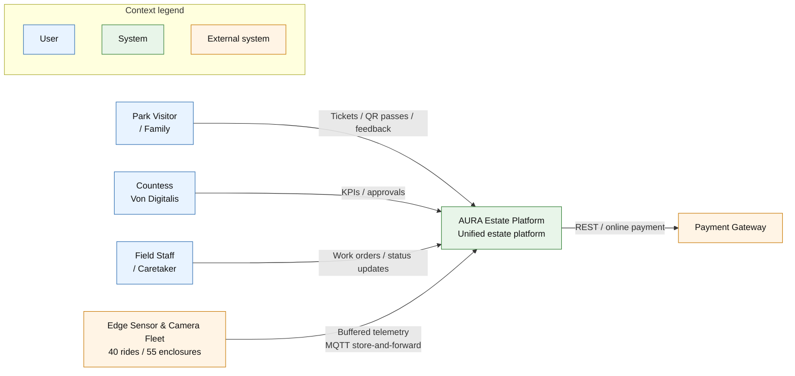

# C1 System Context View

This view defines the macro-system boundary of the Von Digitalis Estate Platform, identifying the external actors, edge environments, cloud boundary, and third-party integrations that shape the platform.

## Scope

- Visitor and family interactions across ticketing, gate entry, and feedback capture
- Maintenance and welfare monitoring for rides and animal enclosures
- Staff dispatch and operational triage
- Executive analytics and human review of AI-generated recommendations

## Architectural intent

The system is intentionally designed as a bounded digital estate platform with edge-first data collection and asynchronous event transfer to central services. This creates resilience in low-connectivity conditions while preserving a coherent cloud-side operational model.

Related views:
- [C2 Container View](./c2-container-view.md)
- [Operational flow: Visitor](./operational-flows/visitor-flow.md)
