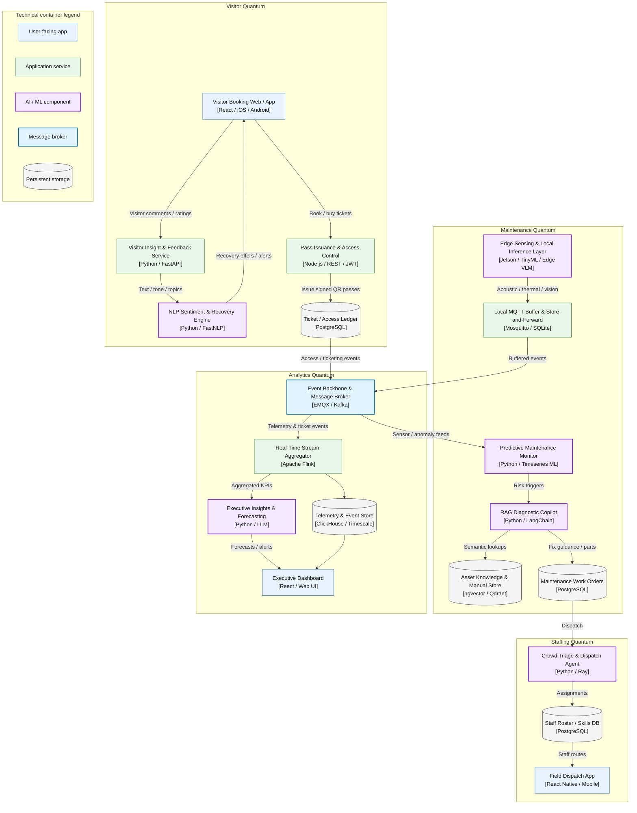

# C2 Container View

This container diagram shows the four architectural quanta and the shared message backbone that connects them.

## Key architecture characteristics

- The Visitor quantum remains the front-door service area optimized for pass issuance, visitor booking, and feedback-driven recovery.
- The Maintenance quantum includes edge sensing, local buffering, anomaly monitoring, and domain knowledge retrieval for repair and welfare operations.
- Staffing and Analytics are event-driven consumers of operational telemetry and insight events.
- The Event Backbone decouples quanta while preserving a single, shared data movement layer for ticket, sensor, and insight flows.

## Design intent

The system intentionally isolates operational concerns while allowing events to bridge them. The Maintenance quantum handles edge resiliency and local processing, the Visitor quantum owns booking and feedback flows, the Staffing quantum optimizes dispatch, and the Analytics quantum consumes the resulting event stream for dashboarding and insight generation. This keeps failure domains independent, supports offline resilience at the edge, and preserves a path for future AI model swaps without disrupting service contracts.
