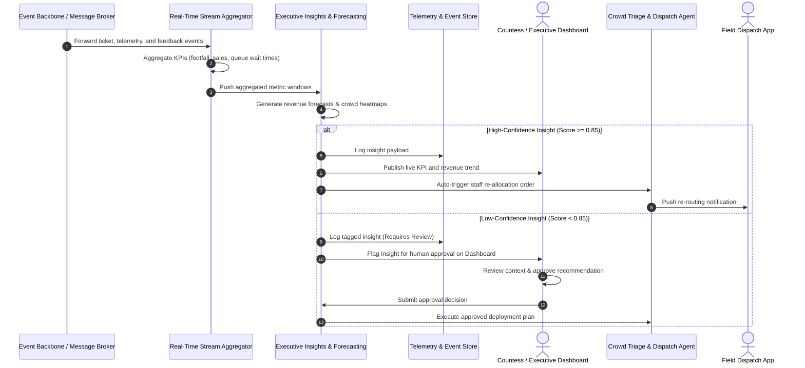

# Executive Analytics & Human-in-the-Loop Intelligence Flow

This flow covers stream aggregation, AI analytics forecasting, confidence scoring, human-in-the-loop validation, and staff re-allocation.

## Operational commentary

This analytics pattern keeps the estate's decision-making transparent and controlled. High-confidence signals can trigger automation, while low-confidence insights stay in a human review loop to protect operational quality and trust.
