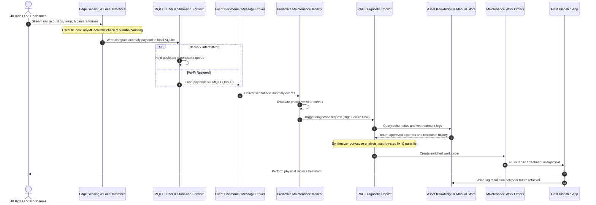

# Predictive Asset Maintenance & RAG Diagnostic Dispatch Flow

This flow covers edge sensor ingestion, TinyML/VLM anomaly detection, store-and-forward transport, vector knowledge retrieval, and field dispatch.

## Operational commentary

The maintenance flow is the critical safety path for the estate. It combines low-latency local inference with a cautious fallback model: if vector similarity is weak or uncertain, the system reverts to safer procedures rather than inventing steps for high-risk physical work.
