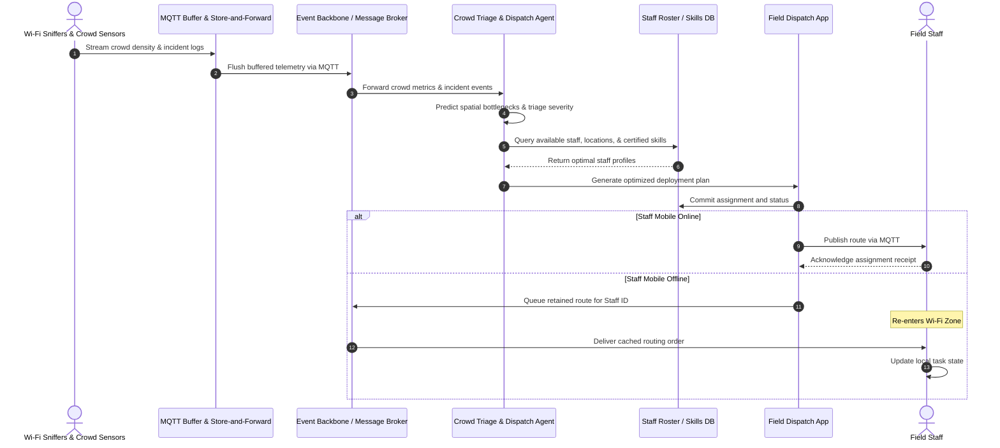

# Spatial Crowd Triage & Staff Dispatch Flow

This flow covers Wi-Fi sniffer crowd density tracking, spatial triage prediction, tactical staff optimization, and offline mobile dispatch.

## Operational commentary

Staff planning is based on dynamic conditions rather than static rosters. The flow favors asynchronous dispatch and retained messaging so that burnout-prone or geographically mobile tasks remain actionable even when staff devices briefly drop offline.
