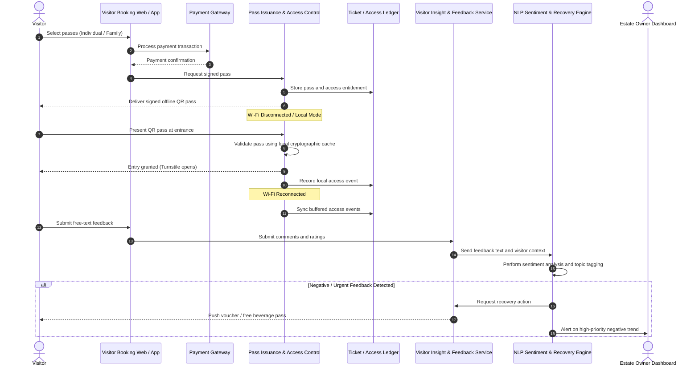

# Visitor Ticketing & AI Feedback Recovery Flow

This flow covers offline gate validation, ticketing ingestion, NLP sentiment evaluation, and dynamic recovery offer generation.

## Operational commentary

This flow highlights the resilient edge-first pass validation pattern and the end-user recovery loop. It keeps entry experiences smooth when connectivity is weak while still feeding back into the estate's insight systems once the network is available.
