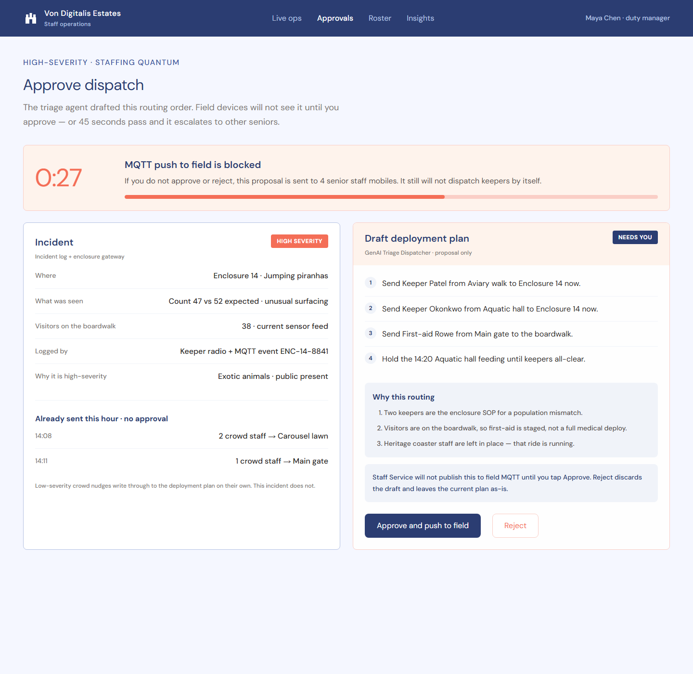
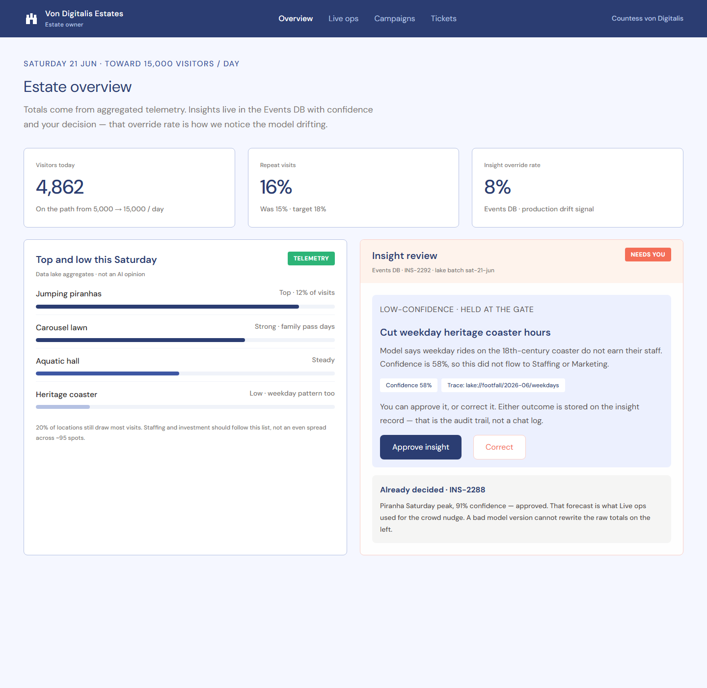

# HMW use sensor data and AI to understand what's actually popular

## Primary Goal

**HMW use sensor data and AI to understand what's actually popular** — an MQTT sensor + AI pipeline that shows which zones and rides are busiest, so staff and investment go where visitors are?

This use case deliberately **spans two quanta**: **Analytics** produces the footfall insight, **Staffing** acts on it. The [architecture characteristics analysis](../design_docs/architecture-characteristics-styles.md) calls this out explicitly rather than forcing a single-quantum fit. See [analytics](../assets/analytics-quantum-architecture.png)/[sequence](../assets/sequence-analytics-quantum.png) and [staffing](../assets/staffing-quantum-architecture.png)/[sequence](../assets/staffing-quantum-sequence.png) diagrams.

## Key screens

The duty manager's live-ops screen is built around one sentence in the page copy: *"Current numbers come from sensors. Forecasts are AI opinion — they do not move staff until they pass the confidence gate."* Two feeds, side by side, never merged:
- **"Now on the estate"** — the live heatmap, sourced straight from the stream processor, explicitly labeled "no AI in this path" and "no confidence score." This is [ADR: Separate Raw Telemetry Path](../ADRs/ADR-004-separate-raw-and-ai-derived-paths.md) made visible in the UI.
- **"Next 60 minutes"** — the AI Analytics Agent's forecast. A 91%-confidence hotspot ("Jumping piranhas will peak") surfaces a one-tap "Send nudge to Staffing" action. A 62%-confidence forecast for the Heritage coaster is shown **held for review** — below the nudge threshold, so no staffing action is sent and the live count on the left stays untouched by it.

For a high-severity incident (a piranha population mismatch with visitors present), the GenAI Triage Dispatcher drafts a full routing order — which keepers to send, why, and what to hold — but the screen's own copy is unambiguous: *"Staff Service will not publish this to field MQTT until you tap Approve."* A visible 45-second countdown escalates to four senior staff mobiles if nobody acts; it still never dispatches on its own. This is [ADR: Authorization Model for AI Staff Dispatch](../ADRs/ADR-013-staffing-ai-dispatch-authorization.md) as a UI, down to the exact 45-second figure. Low-severity crowd nudges, by contrast, are shown already sent ("Already sent this hour · no approval") — the tiering is visible, not just documented.

The Estate Owner's dashboard makes the production-monitoring story concrete: an **"Insight override rate: 8%"** KPI, labeled directly as *"Events DB · production drift signal."* A held, low-confidence insight ("Cut weekday heritage coaster hours," 58% confidence) sits in an explicit **Approve / Correct** review flow — either outcome is written back to the Events DB, which is exactly the override signal [ADR: Production Monitoring & Drift Detection](../ADRs/ADR-001-ai-vendor-risk-and-monitoring.md) is built on. An already-decided insight (91% confidence, approved, used for the earlier crowd nudge) is shown for context: *"A bad model version cannot rewrite the raw totals on the left."*

## High-level solution approach

- **Analytics** is event-driven end to end ([ADR: Event-Driven Architecture Style](../ADRs/ADR-005-analytics-event-driven-style.md)): raw telemetry publishes to the Central Message Broker; the Stream Processor and AI Analytics Agent are independent consumers, neither a hard dependency of the other.
- **Two data stores for two access patterns** ([ADR: Dual Data Store Strategy](../ADRs/ADR-003-dual-data-store-strategy.md)): the Events DB holds individual insight records with confidence, reasoning, and the human approve/correct outcome (what the Estate Owner's "Insight review" panel reads and writes); the data lake/warehouse holds raw and aggregated telemetry at volume (what "Top and low this Saturday" reads).
- **Raw and AI-derived are two separate published feeds, never merged** ([ADR: Separate Raw Telemetry Path](../ADRs/ADR-004-separate-raw-and-ai-derived-paths.md)) — this is what lets "Now on the estate" be trusted unconditionally while "Next 60 minutes" goes through review.
- **Staffing is event-driven and offline-first** ([ADR: Field Staff App Connectivity Strategy](../ADRs/ADR-014-staffing-field-app-connectivity.md)): field handhelds keep a local SQLite store and sync deployment plans/incident logs over MQTT QoS 1, so a dead zone around a ride or enclosure delays a plan rather than losing it — see the [field handheld](../assets/ux-04-field-handheld.png) screen, shared with the Maintenance use case.
- **Tiered human authorization on dispatch** ([ADR: Authorization Model for AI Staff Dispatch](../ADRs/ADR-013-staffing-ai-dispatch-authorization.md)): low-severity crowd nudges write straight to the deployment plan; high-severity proposals block the field MQTT push until a manager approves, with a 45-second escalation matrix as the safety net if nobody's watching.
- Both quanta call the **same Internal AI Gateway** as the Visitors quantum ([ADR: External AI Integration Strategy](../ADRs/ADR-002-external-ai-integration.md)) — one place to fail over a provider, one place to roll back a model version.

## Golden path

1. MQTT telemetry (footfall counters, gate scans) publishes to the Central Message Broker.
2. Stream Processor aggregates it into the live heatmap feed — published directly, no AI, no confidence score, no delay beyond normal processing.
3. AI Analytics Agent separately consumes the same telemetry and produces a hotspot forecast + deployment suggestion, written to the Events DB with a confidence score and reasoning.
4. **If confidence clears the nudge threshold** (e.g. 91% for the piranha boardwalk), a low-severity crowd nudge writes through to the Staffing quantum's deployment plan automatically.
5. **If confidence is below threshold** (e.g. 62% for the Heritage coaster, compounded by 11-minutes-late telemetry), the forecast is held for manager review on the dashboard — no staffing action fires.
6. Separately, a high-severity physical incident (population mismatch, medical need) goes through the GenAI Triage Dispatcher, which drafts a full routing order and blocks the field MQTT push pending manager approval — approve pushes to field handhelds over MQTT QoS 1; reject discards the draft and leaves the current plan unchanged; 45 seconds of silence escalates to senior staff mobiles.
7. Every insight review outcome (approve/correct) and every dispatch decision (approve/reject) writes back to the Events DB, computing the rolling override rate shown on the Estate Owner's dashboard.

## Implementation details

- **The confidence gate is the same mechanism in both quanta, tuned differently**: Analytics gates whether a *forecast* becomes a *nudge*; Staffing gates whether a *proposal* becomes a *field push*. Both are instances of the same "AI drafts, a threshold or a human decides" pattern from [ADR: Production Monitoring & Drift Detection](../ADRs/ADR-001-ai-vendor-risk-and-monitoring.md).
- **Late telemetry is treated as a confidence input, not silently ignored**: the Heritage coaster forecast being held cites "telemetry from that ride arrived 11 minutes late" alongside the raw 62% confidence — staleness degrades trust in a forecast even before the model's own uncertainty is considered.
- **The override-rate KPI is a first-class dashboard element, not a buried log** — visible to the Estate Owner, not just to engineers, which matters for the judges' "how do you verify AI is working" question: this system builds that verification into the primary user's daily view.

## Phased rollout for this use case

Per the [phased AI-adoption roadmap](../README.md#roadmap):
- **Phase 0**: no forecast at all — live heatmap only, staff deployed on manager judgment (exactly today's process, just with better raw visibility than the estate has now).
- **Phase 1**: a same-hour-last-week heuristic lookback, no ML — enough to be directionally useful with zero training data.
- **Phase 2**: once a full seasonal cycle (≥12 months, to separate a one-off spike from a real weekday/weekend/holiday pattern) of footfall exists, train a proper time-series forecasting model.
- Independently, dispatch triage moves from **fully manual** (Phase 0) to **GenAI-drafted, always human-approved regardless of severity** (Phase 1) to **low-severity auto-dispatch once approved/corrected history supports tuning that threshold** (Phase 2) — high-severity incidents stay human-gated at every phase; that boundary does not move with maturity.

## Limitations

- **Manager bottleneck on high-severity dispatch**: if the on-duty manager is away from the dashboard, a critical proposal sits pending until the 45-second escalation fires. Accepted trade-off — see [ADR: Authorization Model for AI Staff Dispatch](../ADRs/ADR-013-staffing-ai-dispatch-authorization.md).
- **Eventual consistency between quanta**: dashboards and field devices see analytics with some lag relative to when an event was produced. Acceptable for popularity/trend reporting; would not be acceptable if a future use case needed near-instant consistency.
- **Override rate is noisy at low review volume** and can lag a real regression if reviewers rubber-stamp AI output — mitigated by the scheduled offline evals in [ADR: Production Monitoring & Drift Detection](../ADRs/ADR-001-ai-vendor-risk-and-monitoring.md), not by this use case alone.
