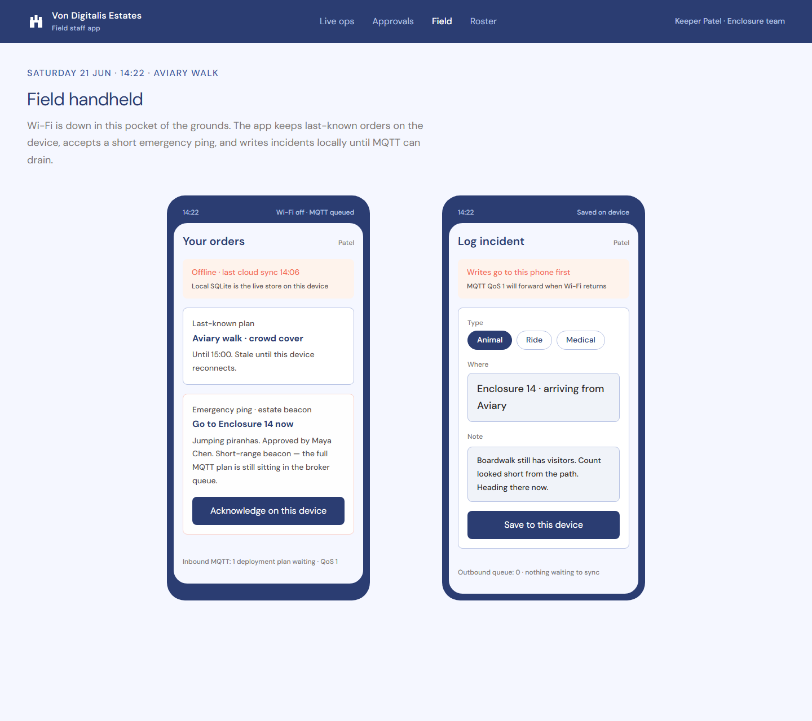

# HMW use AI to keep the animal collection healthy without adding headcount

## Primary Goal

**HMW use AI to keep the animal collection healthy without adding headcount** — computer vision and sensor-based monitoring of feeding, health, and piranha population levels, so issues are caught early rather than discovered too late?

This also covers ride safety monitoring (the 40 vintage rides), since both share the same **Maintenance** quantum and the same ingestion/delivery/guidance pipeline. See the [architecture](../assets/maintenance-quantum-architecture.png) and [sequence](../assets/maintenance-quantum-sequence.png) diagrams.

Refer to the [cost analysis](../design_docs/cost-analysis.md) for the ~93% cost reduction this use case is built to justify.

## Key screens

Keeper Patel's handheld, mid-Wi-Fi-outage, shows exactly what [ADR: Field Staff App Connectivity Strategy](../ADRs/ADR-014-staffing-field-app-connectivity.md) promises: last-known orders held on-device ("Offline · last cloud sync 14:06 · Local SQLite is the live store on this device"), a short-range emergency beacon that reaches the handheld even when the full MQTT deployment plan is still queued in the broker, and an incident log that saves locally first ("Writes go to this phone first · MQTT QoS 1 will forward when Wi-Fi returns") with an outbound queue counter so the keeper can see it isn't lost, just delayed.

This is [ADR: Work Order Guidance Strategy](../ADRs/ADR-012-maintenance-work-order-guidance.md) as a screen. For a piranha count mismatch (47 visible vs. 52 expected), the copilot drafts a work order with a suspected root cause and step-by-step mitigation — but every step is **cited** ("Grounded in: VET-PIR-14 §3.2, ENC-SOP-14 §1.4") and the page copy is explicit: *"The copilot may only draft steps from retrieved estate documents. If retrieval is weak, it escalates — it does not invent a procedure."* The sibling case in the same queue (Heritage coaster WO-185) shows the fail-closed path directly: retrieval confidence too low on the vintage manual index → generic escalate-to-human order, anomaly payload attached, no invented torque spec. The screen also surfaces the ingestion/delivery contract in plain language: *"Edge VLM summary · not raw video"* and *"Event time 14:16 · 5 min late, not lost."*

## High-level solution approach

Three decisions, each answering a different part of "what happens between a sensor and a keeper," in order:

1. **What leaves the estate** ([ADR: Ride and Enclosure Feed Ingestion Strategy](../ADRs/ADR-010-maintenance-feed-ingestion.md)) — on-estate inference only. Ride-side TinyML models publish filtered anomaly payloads, not waveforms; enclosure-side vision models publish health/count summaries, not camera streams, deliberately **biased toward over-flagging** (a false "healthy" is worse than a false alarm). This keeps the estate inside the MQTT-only constraint and keeps cloud cost proportional to incidents, not to 55 continuous cameras.
2. **How it survives patchy Wi-Fi** ([ADR: Ride and Enclosure Event Delivery Strategy](../ADRs/ADR-011-maintenance-event-delivery.md)) — disk-backed store-and-forward at the edge gateway, QoS 1 to the Central MQTT Broker, idempotent-on-event-id consumers. A dead zone produces a delayed backlog, drained severity-first on reconnect, never a silent gap.
3. **What a keeper is handed once an anomaly lands** ([ADR: Work Order Guidance Strategy](../ADRs/ADR-012-maintenance-work-order-guidance.md)) — retrieve-then-generate over a versioned corpus of the estate's own vintage ride manuals and veterinary records, cited, fail-closed to a generic escalation when retrieval is weak.

## Golden path

1. Ride-side acoustic/vibration model or enclosure-side vision model runs on-device, publishes a compact event (anomaly payload or health/count summary) to the local MQTT gateway.
2. Gateway writes to its disk-backed queue first, then forwards to the Central MQTT Broker at QoS 1 as Wi-Fi allows — the queue, not the network, decides when the event is "published."
3. Cloud engines (Predictive Wear Model for rides, Multimodal Animal Health Engine for enclosures) consume the event and, on a real anomaly, trigger the RAG Maintenance Copilot.
4. Copilot retrieves relevant passages from the estate's corpus, drafts a Smart Work Order with cited sources — or, on empty/low-confidence retrieval, opens a generic escalate-to-human order with the anomaly payload attached and no invented steps.
5. Work order dispatches to the relevant field handheld over the same offline-first MQTT path Staffing uses; the keeper confirms before acting — this is the ~15% keeper-review path the [cost model](../design_docs/cost-analysis.md) is built around.
6. Keeper's confirm/escalate/correct outcome is the override signal for this quantum, per [ADR: Production Monitoring & Drift Detection](../ADRs/ADR-001-ai-vendor-risk-and-monitoring.md).

## Implementation details

- **Over-flagging is a deliberate model bias, not a tuning miss**: both the ride and enclosure edge models are explicitly tuned to prefer false alarms over false "healthy" readings, because a missed animal-health or ride-safety event is categorically worse than an unnecessary keeper visit. This directly shapes the ~15% human-review rate the cost analysis assumes.
- **A short local ring buffer, not a media store**: on anomaly, the edge device keeps a brief clip/waveform locally and attaches it to the event once Wi-Fi returns — evidence for the flagged 15%, not a 24/7 cloud video archive. This is how the design avoids the cost/bandwidth blowup of streaming raw feeds while still giving a keeper something to look at for the cases that matter.
- **The corpus is a versioned artifact, not a static config**: manual/vet-record updates are ingest operations (re-chunk, re-index, roll forward or back), the same operational discipline as a model deploy elsewhere in the system — this is the Deployability cost this quantum explicitly accepts in exchange for grounded guidance.

## Phased rollout for this use case

Per the [phased AI-adoption roadmap](../README.md#roadmap), this use case does **not** start with trained models:
- **Phase 0**: static threshold bands (manufacturer vibration/acoustic specs for rides; simple motion/weight sensor thresholds for enclosures) — today's manual-check baseline from the [cost analysis](../design_docs/cost-analysis.md), instrumented but not yet AI-driven.
- **Phase 1**: off-the-shelf, un-tuned models — an unsupervised anomaly detector for ride sensors (needs no labels), a general animal pose/motion vision model for enclosures (not species-specific yet).
- **Phase 2**: once **at least 6 months of sensor history with keeper-confirmed outcomes** exists — long enough to span normal seasonal/usage variance across 40 distinct rides — train per-ride-class supervised models. For animals, this is gated **per species independently**: piranhas need their own minimum confirmed-flag sample separate from land animals, since population dynamics differ; a newly acquired species always restarts at Phase 1.
- The RAG copilot is the exception to this curve — it needs a document corpus, not training data, so it can run at meaningful quality from Phase 1 onward, as long as the manuals/vet records are digitized and chunked.

## Limitations

- **Deployability across ~95 locations** is harder than shipping one cloud model — mitigated by treating edge models as versioned fleet artifacts with staged rollout and rollback, not by avoiding the fleet.
- **Upfront device cost** is real; the estate's MQTT-hardware budget is finite, so higher-cost vision boxes are prioritized on high-risk assets (heritage rides, piranha enclosures) first rather than instrumenting every location on day one.
- **Cannot freely rewind raw media** the way a full video archive would allow — the short local ring buffer only captures the moment of a flagged anomaly, by design.
- **Retrieval can miss or serve a stale page** — mitigated by failing closed (escalate rather than guess) and by making citations visible so a technician can catch a bad retrieve before acting on it, never eliminated outright.
